# RE5 ビルドガイド

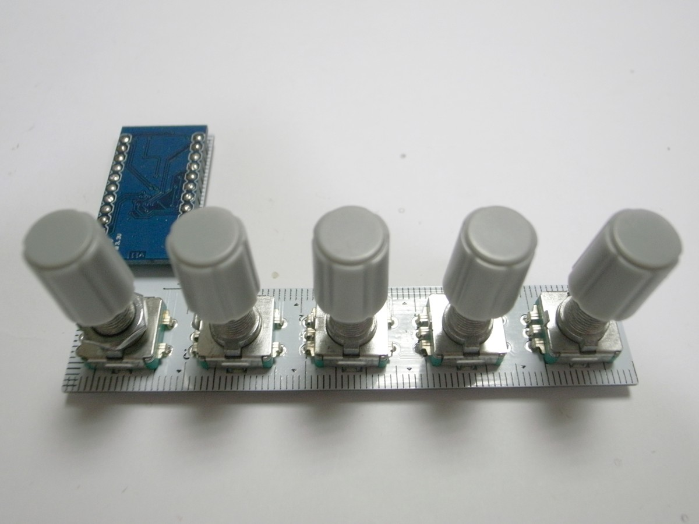

## 必要なパーツ
| 名前 | 数 | 備考 | 調達先の例 | 参考価格（送料込） |
|:-|:-|:-|--|--|
| RE5 PCB | 1枚 | [入手方法はこちら](pcb_order_guide_jp.md) | [Elecrow Online Store](https://www.elecrow.com/pcb-manufacturing.html) | 10枚で1,400円($12.94) |
| Pro Micro | 1個 | スルーホールをZigzag仕様にしてあるのでコンスルーではなく普通の付属ピンヘッダを使います | [AliExpress](https://www.aliexpress.com/)で「Pro Micro ATmega32U4 5V 16MHz」を検索 | 290円($2.66) |
| Dシャフト（平軸） プッシュスイッチ付きロータリーエンコーダー | 5個 |  | https://ja.aliexpress.com/item/32835514781.html | 5個で230円($2.12) |
| Dシャフト ロータリーエンコーダー用キャップ | 5個 |  | https://ja.aliexpress.com/item/4000111239246.html | 10個で110円($1.01) |
| クッションゴム または すべりどめシート | 1袋 |  | ダイソー クッションゴム 14個入り または すべりどめシート | 108円 |
| Micro USBケーブル | 1本 | 通信ができるもの | ダイソー | 108円 |
| 計 |  |  |  | 2,246円 |

## 使用する道具、消耗品

[使用する道具、消耗品](../common/tool_guide_jp.md)を参照ください。

## ビルドガイド

### Pro Microのもげ防止加工

Pro Microにエポキシ接着剤を盛って、簡単にはもげないようにします。

- 参考1:[ProMicroのモゲ防止ついでにQMK_Firmwareを書き込む - Qiita](https://qiita.com/hdbx/items/2f3e4ddfcadda2a5578e)

- 参考2:[もげ予防 - Self-Made Keyboards in Japan](https://scrapbox.io/self-made-kbds-ja/%E3%82%82%E3%81%92%E4%BA%88%E9%98%B2)

まずエポキシ接着剤の2液を混ぜます。

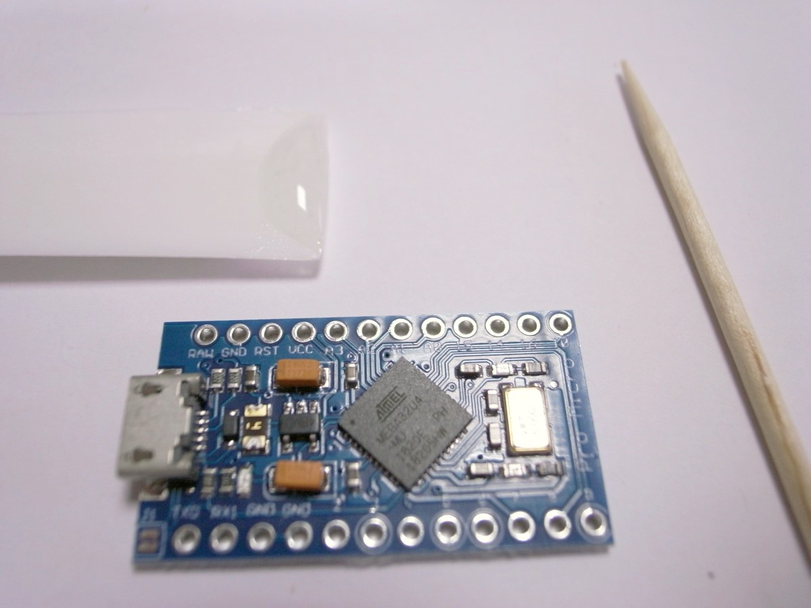

接着剤を付け始める前にMicro USBコネクタを横から見てください。側面に穴が開いています。この穴に接着剤が入ると端子が入らなくなったり、入りにくくなったりします。

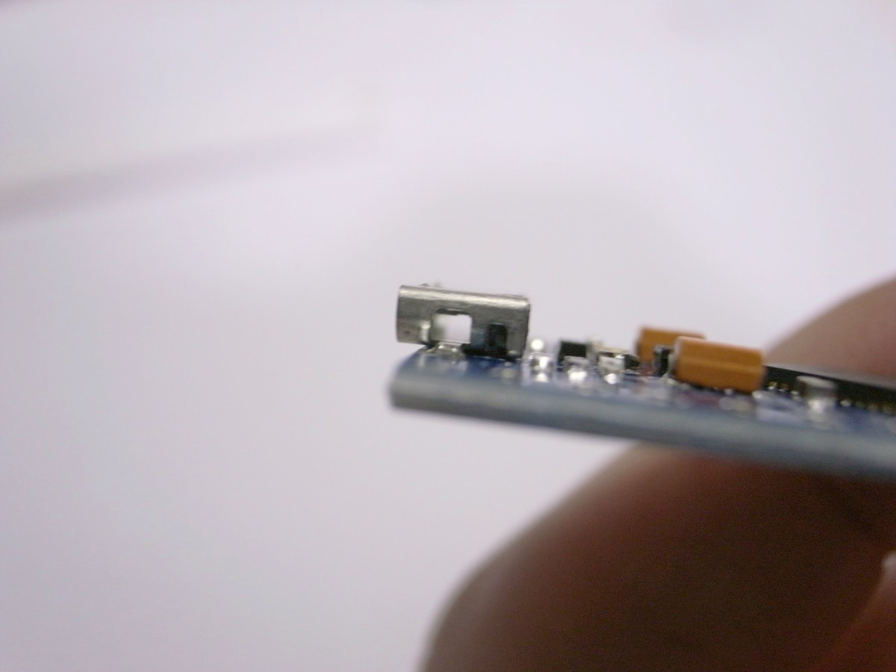

この穴を避けて、つまようじなどで側面と背面に接着剤を盛っていきます。なお、このPro Microは裏返した状態で基板に接することになるため、Micro USBコネクタより上に接着剤が盛り上がらないようにしてください。

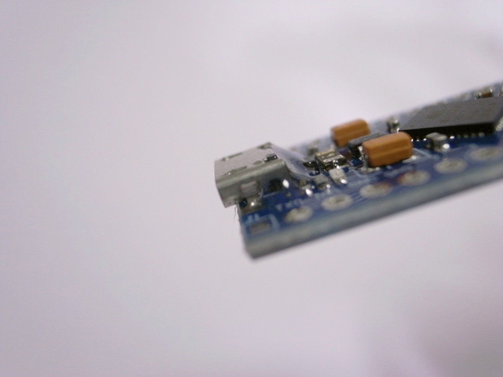

乾くまで置いておきます。

### ロータリーエンコーダーの取り付け

表側（ミリメートル目盛線がある側）から差し込み、裏側をはんだ付けします。

まずは対角の2箇所をハンダ付けし、傾いている場合はハンダを温めて傾きを解消してから残りの箇所をハンダ付けしてください。

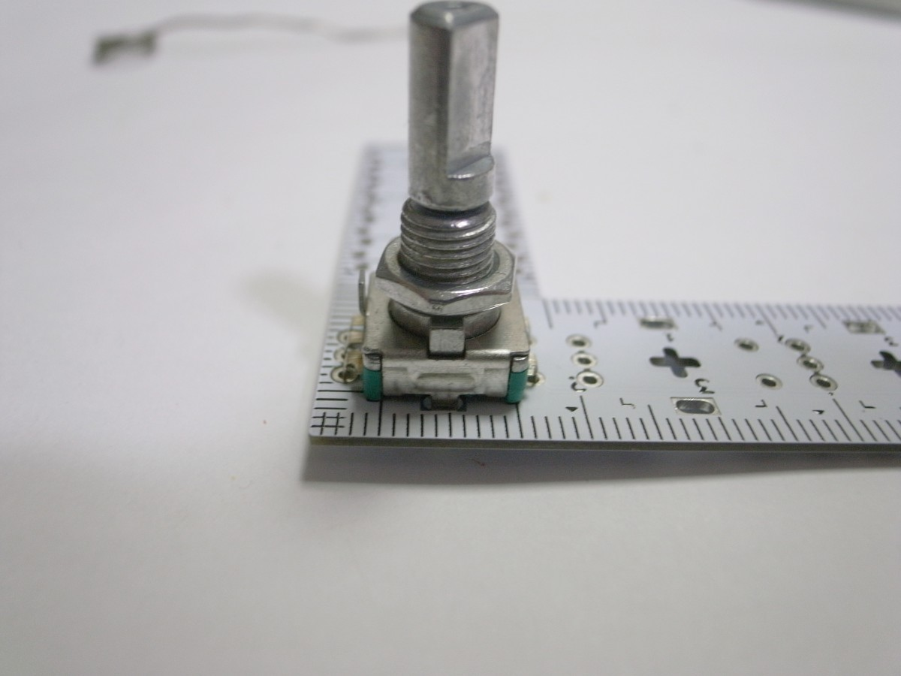

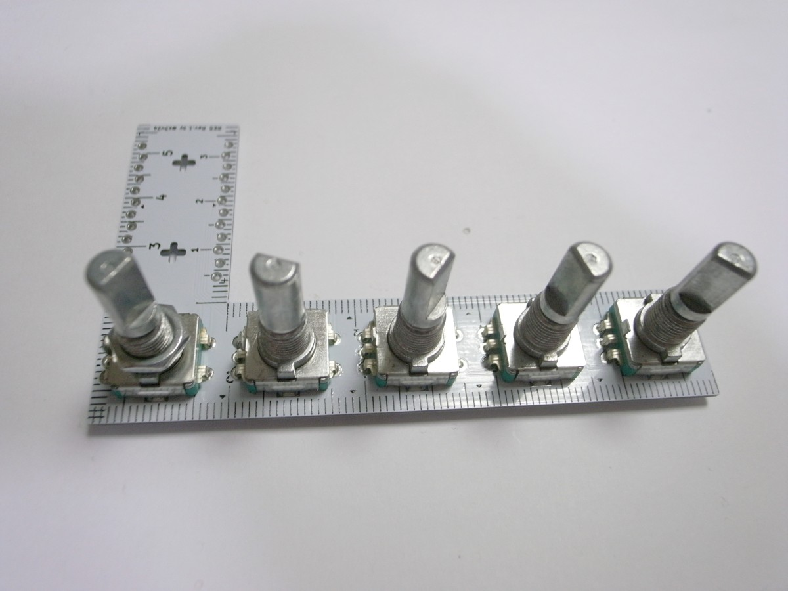

全部取り付け終わったら、ロータリーエンコーダーにキャップを取り付けます。

### Pro Microの取り付け

基板の表側のPro Micro設置部分の2列スルーホールに、Pro Microに付属している12ピンのピンヘッダの短い側を根本まで差し込みます。

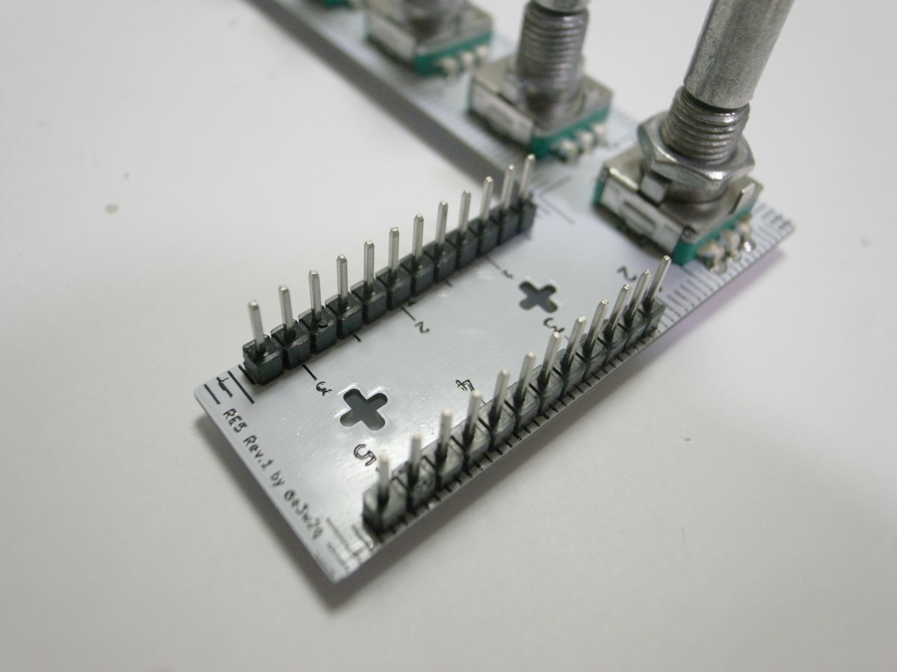

スルーホールがジグザグになっているので、少し入れにくくなっています。ゆっくり押し込んでください。

ピンヘッダにPro Microを差し込みます。**Pro Microの裏面（平らなほう）が上になるように、またマイクロUSBが基板端になるように**します。

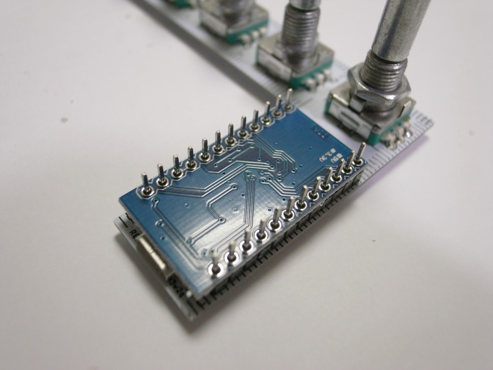

**向きを間違えるとリカバリーが大変です。表裏、左右をよく確認してください。**

ニッパーでPro Microからはみ出したピンヘッダの足を切ります。

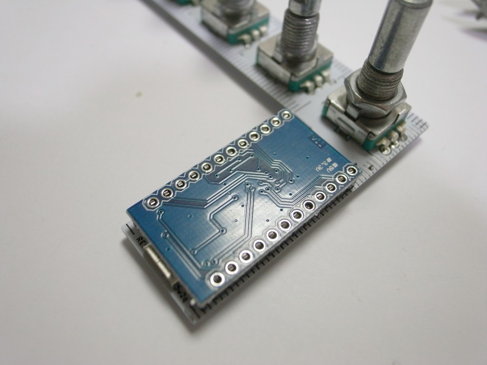

Pro Microとピンヘッダをハンダ付けします。まず四隅をハンダ付けし、横から見てピンヘッダとの間に隙間があればハンダを温めながら押さえて隙間がなくなるようにします。そのあと、順番に全てハンダ付けします。

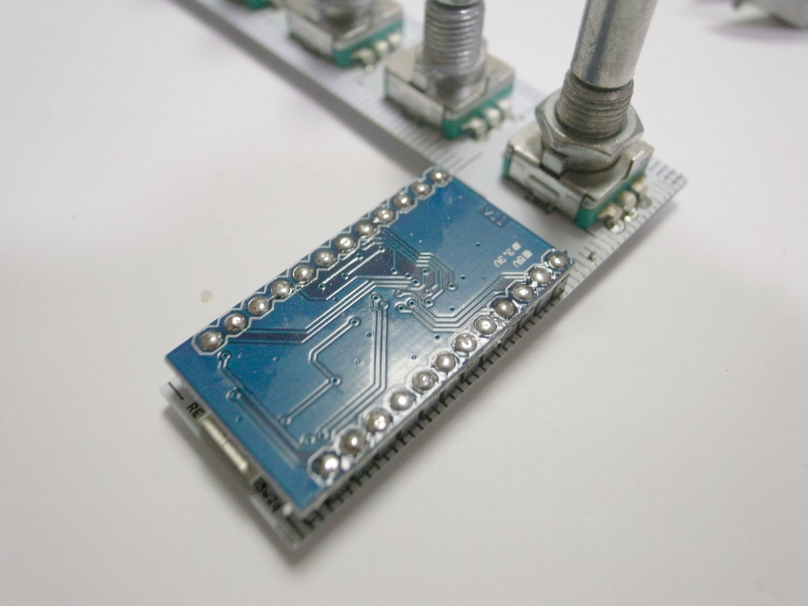

基板とピンヘッダはジグザグのスルーホールで接触しているため、ハンダ付けは不要です。

### クッションゴムまたは滑り止めシートの取り付け

ゴム足を裏面に取り付けます。または、両面テープで滑り止めシートを貼り付け、はみ出した部分をカットします。つまみを回すという動作が発生するので、滑り止めシートのほうが安定します。

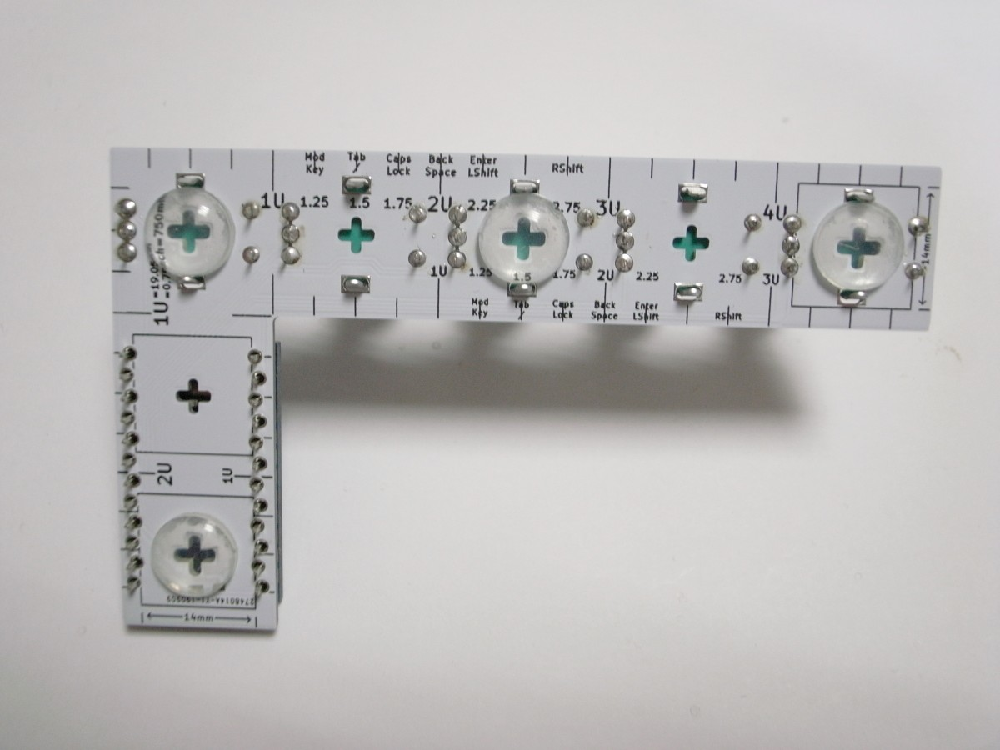

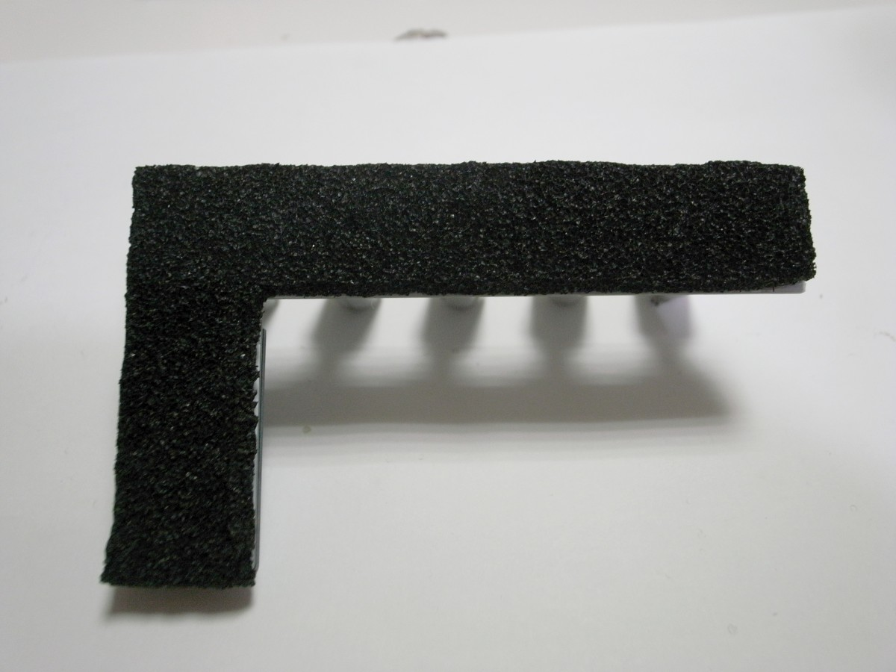

### ファームウェアの書き込み

以下のリンク先を参考にして、QMK Firmwareのビルド環境を用意します。

- Windows
  - [QMKビルド環境の構築(Windows Msys2編)](https://gist.github.com/e3w2q/4bc86e531d1c893d3d13af3e9895a94a)
- macOS
  - [セットアップ - QMK Firmware](https://docs.qmk.fm/#/ja/newbs_getting_started?id=macos)
- Linux
  - [セットアップ - QMK Firmware](https://docs.qmk.fm/#/ja/newbs_getting_started?id=linux)

構築中、

```
qmk setup
```

と入力する代わりに

```
qmk setup e3w2q/qmk_firmware --branch e3w2q
```

と入力してください。

または、`qmk setup`した後に、`C:\Users\USER_NAME\qmk_firmware\keyboards`配下に[https://github.com/e3w2q/qmk_firmware/tree/e3w2q/keyboards/e3w2q](https://github.com/e3w2q/qmk_firmware/tree/e3w2q/keyboards/e3w2q)以下をコピーしてもよいです。

用意されたキーマップを書き込むには以下を実行します。

```
qmk flash -kb e3w2q/re5/rev1 -km default
```

**Detecting USB port, reset your controller now...** と表示されたら下図の赤マル同士をピンセットや針金で一瞬短絡させると書き込みが始まります。

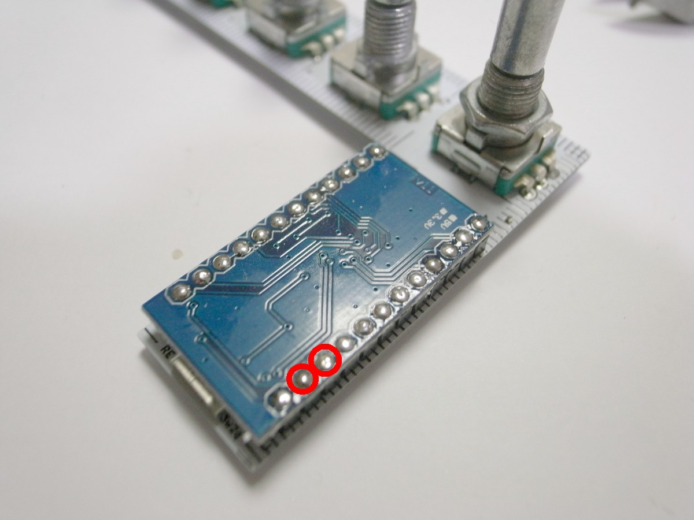

デフォルトのキーマップは以下のようになっています。

| 左から         | 1番目          | 2番目          | 3番目    | 4番目                | 5番目            |
| -------------- | -------------- | -------------- | -------- | -------------------- | ---------------- |
| ツマミ左回転時 | カーソルキー左 | カーソルキー上 | PageUp   | マウスホイール上回転 | 音量下げ         |
| ツマミ右回転時 | カーソルキー右 | カーソルキー下 | PageDown | マウスホイール下回転 | 音量上げ         |
| プッシュ時     | 未設定         | 未設定         | 未設定   | シフトキー           | ミュート切り替え |

動作を確認できたら完成です。お疲れさまでした。

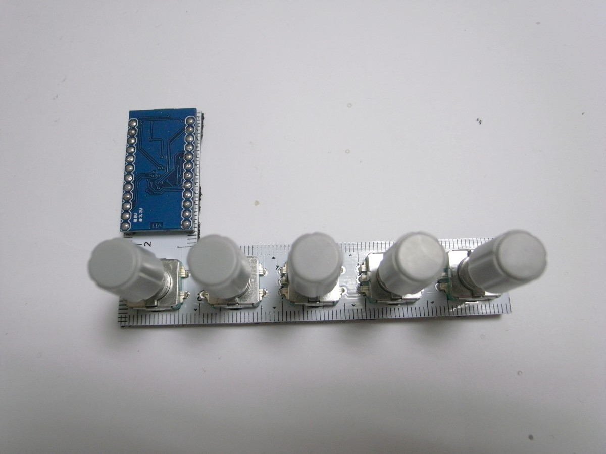